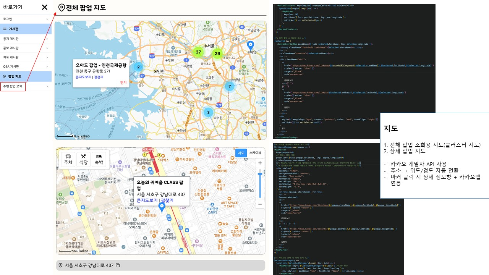
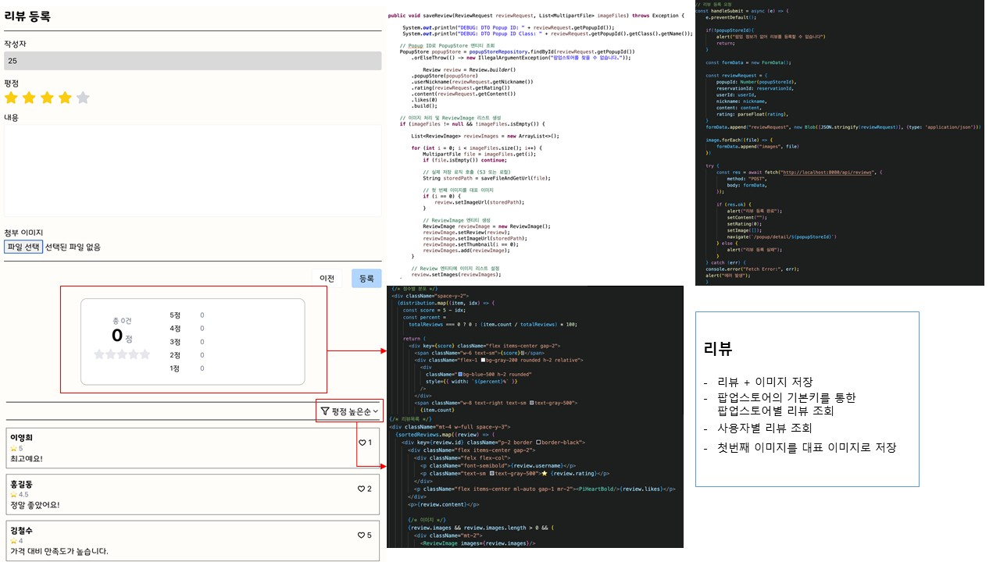
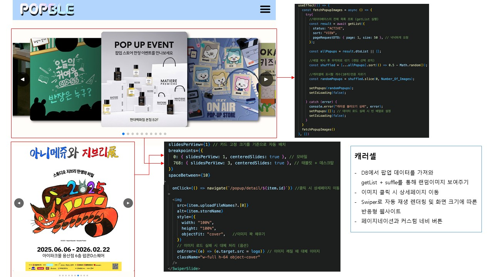

# POPBLE
###### 기간 : 2025.08 ~ 2025.09
###### 기여도 : 70%

#
## 목차
##### 1.프로젝트 목적
##### 2.프로젝트 내용
##### 3.진행과정
##### 4.담당 파트

#
## 1.프로젝트 목적
##### : 흩어져있는 전국의 팝업스토어 정보를 한곳에서 탐색하고 실시간 예약까지 가능한 웹서비스

## 2.프로젝트 내용
##### '기존 소수 웹페이지의 가독성과 기능들로 인한 팝업 인지 및 예약 효율 저하' 문제점 발견
##### 이를 보완하기 위해
#####   - 편의성 : 복잡한 정보를 통합하여 한 곳에서 해결 가
#####   - 사용자 중심 : 맞춤형 정보를 제공하여 사용자에게 최적화된 정보 제공
#####   - 실시간 예약 : 예약관련 기능과 정보를 실시간으로 처리 및 확인 가능
#####   - 정보 소통 활성화 : 게시판 및 공지 기능을 통해 사용자 간 정보 소통 활성화

#
### 주요 담당 기능
#### 지도

#### 리뷰 게시판

#### 캐러셀

